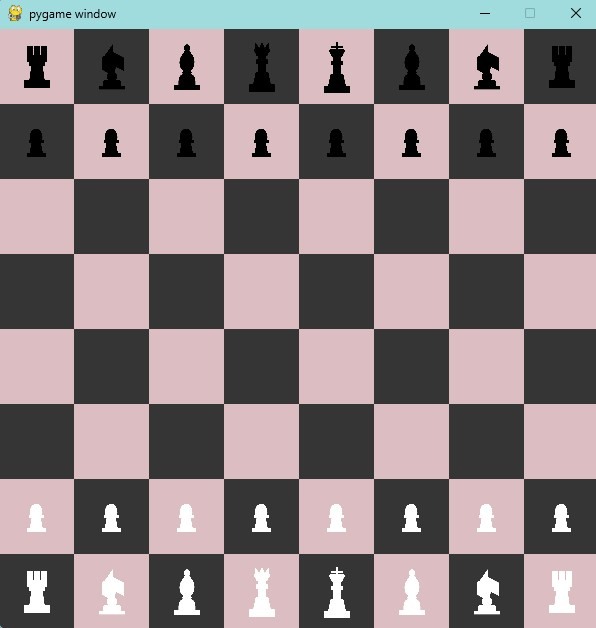

# Two-Player Chess Game in Python 🏆

This repository contains a Python-based two-player chess game built using the Pygame library. The project is an educational exercise aimed at understanding the fundamentals of game development, specifically creating a classic chess game that can be played by two players on a local machine. It was made with the help of a tutorial which has been linked below

## Features

- Classic two-player chess gameplay.
- Graphical interface for intuitive interaction.
- Game logic that adheres to standard chess rules.
- Turn-based system and move validation.

### Output

#### Tutorial Reference 📚

[The Python Code](https://thepythoncode.com/article/make-a-chess-game-using-pygame-in-python).

 A huge thanks to them for providing such a detailed and beginner-friendly guide!

---
